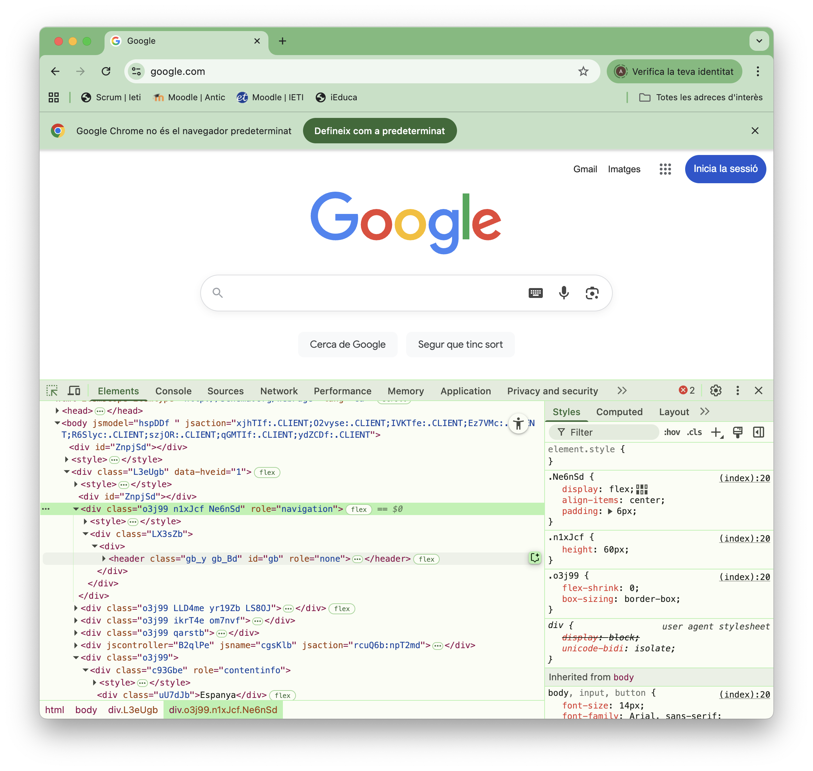

# CSS bàsic

## Què és CSS?

**CSS (Cascading Style Sheets)** és el llenguatge que serveix per definir l’aspecte (colors, mides, marges, fonts...) dels elements HTML d’una pàgina web.

Dit d’una altra manera:

```text
Si HTML és l’esquelet de la pàgina (estructura i contingut),
CSS és el disseny i decoració (colors, aparença).
```

[Documentació CSS](https://developer.mozilla.org/en-US/docs/Web/CSS#reference)

## Maneres de definir CSS

Hi ha tres maneres principals d’afegir CSS a una pàgina web:

### CSS en línia (inline CSS)

S’escriu directament dins de l’atribut style de l’element HTML.

```html
<p style="color: red; font-size: 20px;">Aquest text és vermell i gran.</p>
```

<span style="color:#AA0000; font-weight: bold;">Important</span>: S'ha d'evitar aquesta manera de definir CSS, perquè normalment el valor de l'atribut **"style"** es modificar a partir de la programació amb *JavaScript*.

### CSS dins del document (internal CSS)

S’escriu dins de l’element `<style>` que va a la secció `<head>` de la pàgina HTML.

Dins d'aquest element es defineixen les propietats CSS, en aquest exemple diem que volem mostrar els elements de paràgraf `<p>` de color blau i el doble de gran de l'habitual.

```html
<head>
  <style>
    p {
      color: blue;
      font-size: 2em;
    }
  </style>
</head>
<body>
  <p>Aquest text és blau.</p>
</body>
```

<span style="color:#AA0000; font-weight: bold;">Important</span>: D'aquesta manera els estils definits només afecten la pàgina on es defineixen. Quan hi ha molt codi CSS costa d'organitzar.

### CSS en un fitxer (external CSS)

S’escriu en un arxiu .css separat i s’importa amb un element `<link>` dins del `<head>`.
```html
<head>
    <link rel="stylesheet" href="estils.css">
    <title>Estils</title>
</head>
```

**Exemple-00**: Obrir amb "Show preview" la pàgina "02-Web/02-CSSBàsic/exemple-00/.html"

<span style="color:#AA0000; font-weight: bold;">Important</span>: Moltes pàgines web, defineixen els estils combinant les tècniques anteriors:

- **Inline**: per CSS modificat a través de JavaScript
- **Internal**: per ajustos específics del document
- **External**: per compartir estils entre diverses pàgines web

## Maneres d’assignar CSS als elements HTML

Un cop definits els estils, els podem aplicar de diferents maneres:

### Per selector

Afecta a tots els elements d'aquell tipus, en aquest cas tots els `<p>` tindràn color lila:
```css
p {
  color: purple;
}
```

### Per identificador "id"

S’aplica a un element amb un id únic. Els identificadors han de ser únics a la pàgina, no poden estar repetits.

<span style="color:#AA0000; font-weight: bold;">Important</span>: Cada element ha de tenir un **id** diferent, per tant un estil definit amb **id** només es pot aplicar a un element.

Al CSS es defineix amb **#** davant del selector:
```css
#titol {
  font-size: 24px;
  text-decoration: underline;
}
```
```html
<h1 id="titol">Títol principal</h1>
```

### Per atribut "class"

Afecta tots els elements, que posin el selector definit al CSS a l'atribut **class"**. Pot aparèixer tants cops com calgui, i aes poden acumular diverses "class" en un mateix element.
```css
.text-important {
  color: red;
  font-weight: bold;
}
```
```html
<p class="text-important">Aquest text és vermell i en negreta.</p>
```

Les diferències amb l'**id** són que:
- Es pot assignar aquell estil a múltiples elements 
- Es poden assignar múltiples etiquetes a l'element class

```css
.vermell {
  color: red;
}
.gran {
  font-size: 24px;
}
.negreta {
  font-weight: bold;
}
.subratllat {
  text-decoration: underline;
}
```
```html
 <h1 class="vermell gran">Títol vermell i gran</h1>

<p class="negreta">Aquest paràgraf és només en negreta.</p>

<p class="vermell subratllat">Aquest paràgraf és vermell i subratllat.</p>

<p class="gran negreta subratllat">
  Aquest paràgraf és gran, en negreta i subratllat.
</p>
```

**Exemple-01**: Obrir amb "Show preview" la pàgina "02-Web/02-CSSBàsic/exemple-01/index.html"

## Pseudo-classes CSS

Les **Pseudo-classes** són “estats especials” que serveixen per aplicar estils quan passa una condició, s’escriuen amb : davant del nom.

**Interacció amb l'usuari**

- **:hover** → quan el ratolí passa per sobre d’un element.
- **:active** → quan l’element està sent clicat.
- **:focus** → quan l’element (per exemple, un input) té el focus del teclat.

**Posició dins del contenidor**

- **:first-child** → el primer fill d’un element.
- **:last-child** → l’últim fill d’un element.
- **:nth-child(n)** → el fill número n (o amb patrons com odd, even).
- **:first-of-type**, 
- **:last-of-type** → el primer/últim element d’un tipus concret.

**Per estat de formularis**

- **:checked** → un checkbox o radiobutton seleccionat.
- **:disabled** → un element de formulari deshabilitat.
- **:enabled** → un element de formulari habilitat.
- **:required** → un camp obligatori.
- **:valid / :invalid** → segons si el valor del formulari és vàlid o no.

**Exemple-02**: Obrir amb "Show preview" la pàgina "02-Web/02-CSSBàsic/exemple-02/index.html"

## Jerarquia de selectors combinats

Es poden crear selectors combinats amb els caràcters espai " " i major ">".

### Jerarquia combinada amb caràcter espai " "

Selecciona els elements descendents d’un altre, encara que no siguin fills directes.

El següent selector defineix que qualsevol element `<p>` dins d'un element `<div>` serà de color vermell:
```css
div p {
  color: red;
}
```
```html
<div>
  <p>Vermell</p>
  <section>
    <p>També vermell</p>
  </section>
</div>
```

### Jerarquia combinada amb caràcter major ">"

Selecciona només els elements que són fills directes del pare.
```css
#base > h2 {
  color: blue;
}
```

Només els elements `<h2>` que estàn directament a sota d'un element amb identificador "base" seràn de color blau.
```html
<div id="base">
  <h2>Aquest serà blau</h2>
  <section>
    <h2>Aquest no és blau</h2>
  </section>
</div>
<div>
  <h2>Aquest no és blau</h2>
</div>
```

## Pseudo-elements CSS

Els pseudoelements serveixen per afegir contingut o aplicar estils a parts concretes d’un element, encara que no estiguin escrites directament a l’HTML.

S’escriuen amb :: davant del nom.

```css
p::before {
  content: "👉 ";
  color: blue;
}

p::after {
  content: " ✔";
  color: green;
}
```
```html
<p>Aquest paràgraf tindrà símbols afegits.</p>
```

**Exemple-03**: Obrir amb "Show preview" la pàgina "02-Web/02-CSSBàsic/exemple-03/index.html"

## Manipular CSS al navegador

Els navegador tenen eines de desenvolupament, que permeten manipular el codi HTML i el codi CSS.

Això permet provar valors, per després aplicar-los al codi original.

```text
Menú del navegador > Més eines > Eines de desenvolupament
```

O amb les combinacions de tecles
```text
Ctrl + Shift + I (Windows i Linux)
Command (⌘) + Option (⌥) + I (Mac)
```

<center>

</center>