# Dissenys comuns

## Variables

CSS permet posar variables. Aquestes poden tenir:

- Àmbit global si es defineixen dins de **":root"**
- Àmbit local si es defineixen dins d'una definició de selector específica.

```css
:root{ 
  --navH: 64px;      /* àmbit global */
  --pageMax: 980px;  /* àmbit global */
}
```

La definició de variables es pot posar dins de les definicions específiques, o de manera global dins de **":root"**

Per fer servir els valors definits a les variables fem servir **"var(--navH);"**

```css
.infoContainer { 
    --horizPadding: 32px; /* àmbit local */

    padding-left: var(--horizPadding);
    padding-right: var(--horizPadding);
    width: calc(100% - 2 * var(--horizPadding)); /* 100% - 32px */
}
```

## Autocenter

Fer un espai central que tingui una amplada màxima i que es centri automàticament.

```css
.autocenter {
  max-width: 800px;
  margin: auto;
  padding: 0 15px;
}
```

A la carpeta "./02-Web/Dissenys/exemple-00", a l'arxiu "index.html" escollir la opció **"Show Preview"** per veure la pàgina web.

<center>
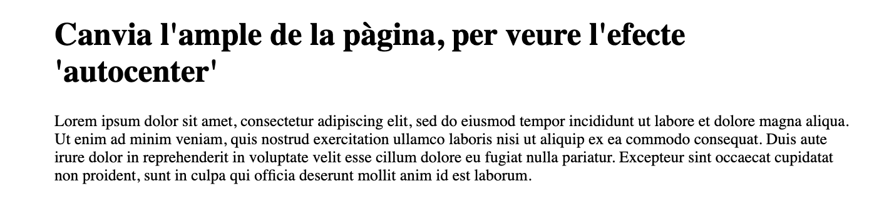
</center>
<br/>

## Text emplenat de gradient

Per donar un efecte de text amb gradient de colors, es defineix el background amb un gradient, i es fa servir `background-clip: text` per fer que el fons només afecti al text. Finalment es posa el color del text a transparent.

**Important!** *"-webkit-background-clip"* és necessari per a que funcioni a l'iPhone, en comptes de *"background-clip"*.

```css
.gradient-text {
  background: conic-gradient(#ec8c86,#d78191,#c1759c,#8eabcb,#7cbddb,#91c6a8,#b4d48d,#dfc17e,#ec8c86);
  -webkit-background-clip: text;
  background-clip: text;
  color: transparent;
  font-size: 5em;
  font-weight: bold;
}
```

A la carpeta "./02-Web/Dissenys/exemple-01", a l'arxiu "index.html" escollir la opció **"Show Preview"** per veure la pàgina web.

<center>
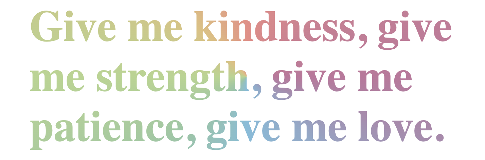
</center>
<br/>

## Fotografia anys 70

Les fotografies dels anys 70 tenien un estil molt característic, amb els colors saturats, els cantons arrodonits i una ombra que donava profunditat.

```css
.picture70block { 
  box-sizing: border-box;
  padding: 16px;
  width: 100%;
}

.picture70img { 
  border-radius: 16px;
  box-shadow: 0 5px 10px 0 rgba(0,0,0,0.20) , 0px 2px 17px 0px rgba(0,0,0,0.20);
  box-sizing: border-box;
  filter: saturate(150%);
  width: 100%;
}
```

A la carpeta "./02-Web/Dissenys/exemple-02", a l'arxiu "index.html" escollir la opció **"Show Preview"** per veure la pàgina web.

<center>
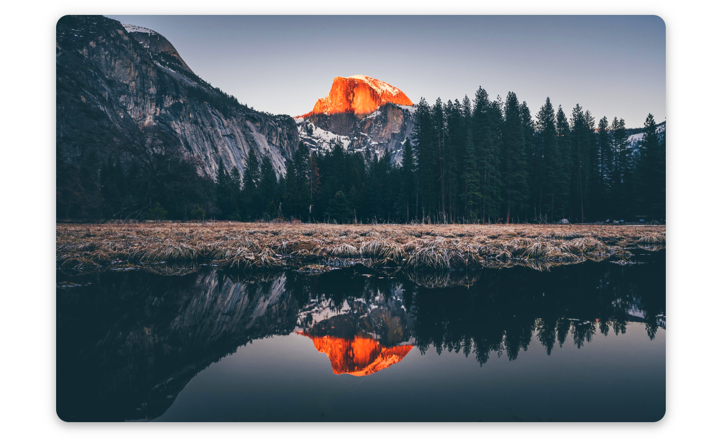
</center>
<br/>

## Fotografia estil Polaroid

Les fotografies amb Polaroid permeten escriure un text a sota de la imatge.

```css
.polaroidBlock { 
  box-sizing: border-box;
  padding: 32px;
  width: 100%;
}

.polaroidFrame { 
  border-radius: 8px;
  box-shadow: 0px 5px 15px 2px rgba(0,0,0,0.20);
  padding: 16px;
  transform: rotate3d(0, 0, 1, 358deg);
}
```

A la carpeta "./02-Web/Dissenys/exemple-03", a l'arxiu "index.html" escollir la opció **"Show Preview"** per veure la pàgina web.

<center>
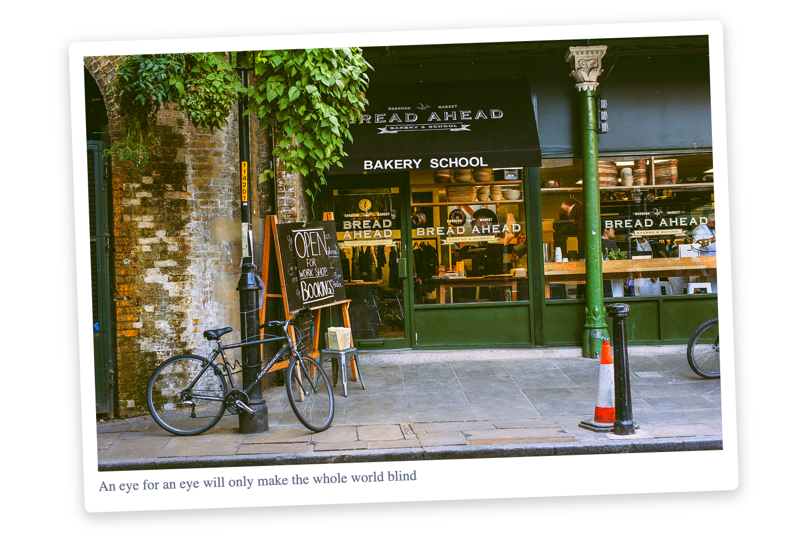
</center>
<br/>

## Fotografia estil Vintage

Les fotografies amb estil Vintage tenen un efecte de color antic.

```css
.vintageBlock {
  box-sizing: border-box;
  padding: 32px;
  width: 80%;
}

.vintageFrame {
  background: linear-gradient(-15deg, #faf7e3, #d7ca99);
  border-radius: 16px;
  box-shadow: 0px 5px 15px 2px rgba(0,0,0,0.20);
  padding: 16px;
  transform: rotate(-2deg);
  transition: all 0.3s ease-in-out;
}
```

A la carpeta "./02-Web/Dissenys/exemple-04", a l'arxiu "index.html" escollir la opció **"Show Preview"** per veure la pàgina web.

<center>
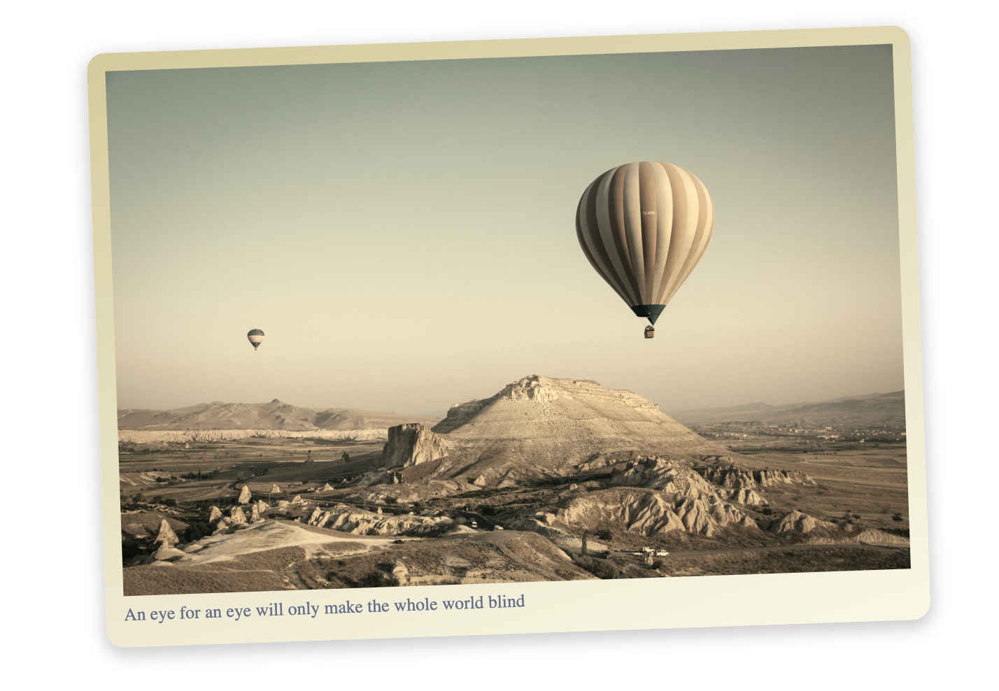
</center>
<br/>

## Retallar text amb ...

Per tal de **"retallar un text amb ..."** cal definir el CSS amb:

```css
.truncate-single {
    width: 250px;             /* amplada màxima */
    white-space: nowrap;      /* no fer salts de línia */
    overflow: hidden;         /* amaga el que sobrepassa */
    text-overflow: ellipsis;  /* mostra ... al final */
    border: 1px solid #ccc;
    padding: 4px;
}
```

> **Nota*: Encara no hi ha un estàndard CSS per fer un text multilinia amb "..." i no funciona amb firefox

A la carpeta "./02-Web/Dissenys/exemple-05", a l'arxiu "index.html" escollir la opció **"Show Preview"** per veure la pàgina web.

<center>
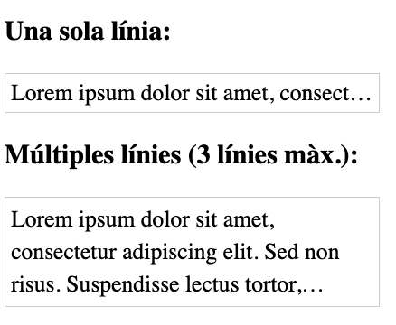
</center>
<br/>

## Text centrat amb subtítol

L'exemple mostra un contenedor simple, amb un *títol* i un *subtítol* centrats.

A la carpeta "./02-Web/Dissenys/exemple-06", a l'arxiu "index.html" escollir la opció **"Show Preview"** per veure la pàgina web.

<center>

</center>
<br/>

## Imatge com a *Background*

Habitualment, quan es divideix una secció amb dues parts, una conté una imatge però que es mostra com un ["background"](https://developer.mozilla.org/en-US/docs/Web/CSS/background-image) enlloc de dins del seu propi element.

A la carpeta "./02-Web/Dissenys/exemple-07", a l'arxiu "index.html" escollir la opció **"Show Preview"** per veure la pàgina web.

<center>
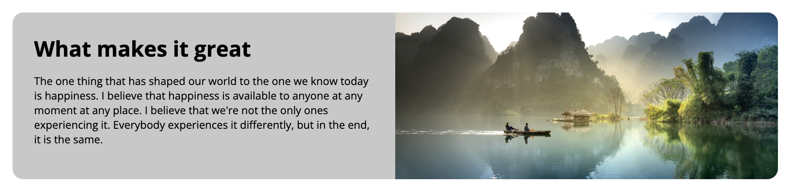
</center>
<br/>

## Caixes o mòduls

Organitzar la informació en caixes o mòduls, permet reutilitzar definicions CSS i organitzar visualment la informació.

A la carpeta "./02-Web/Dissenys/exemple-08", a l'arxiu "index.html" escollir la opció **"Show Preview"** per veure la pàgina web.

<center>
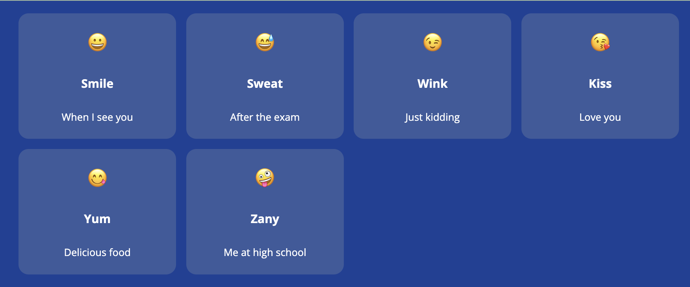
</center>
<br/>

## Targes o *Cards*

Les targetes són una altra forma d'organitzar la informació. Sovint, amb sombrejat per separar-ne el contingut com si fós una tarja real.


A la carpeta "./02-Web/Dissenys/exemple-09", a l'arxiu "index.html" escollir la opció **"Show Preview"** per veure la pàgina web.

<center>
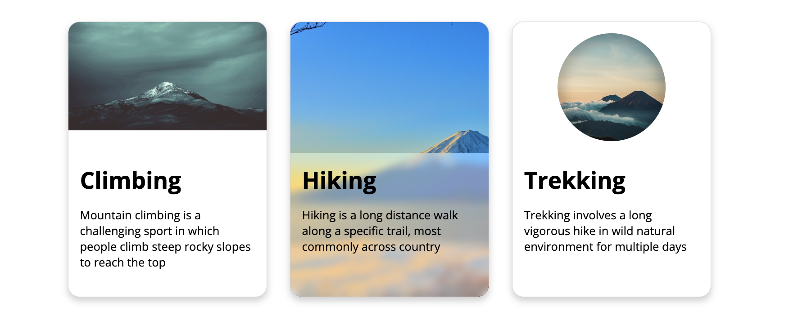
</center>
<br/>

## Títol amb imatge centrada de fons

Sovint els títols tenen una imatge de fons, centrada al contingut.

A la carpeta "./02-Web/Dissenys/exemple-10", a l'arxiu "index.html" escollir la opció **"Show Preview"** per veure la pàgina web.

<center>
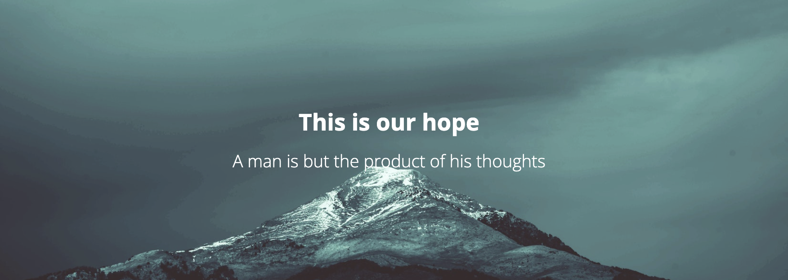
</center>
<br/>

## Imatge amb quadre de text

Per tal de fer **"llegible"** els texts sobreposats a les imatges, a vegades es posen en quadres de text.

A la carpeta "./02-Web/Dissenys/exemple-11", a l'arxiu "index.html" escollir la opció **"Show Preview"** per veure la pàgina web.

<center>
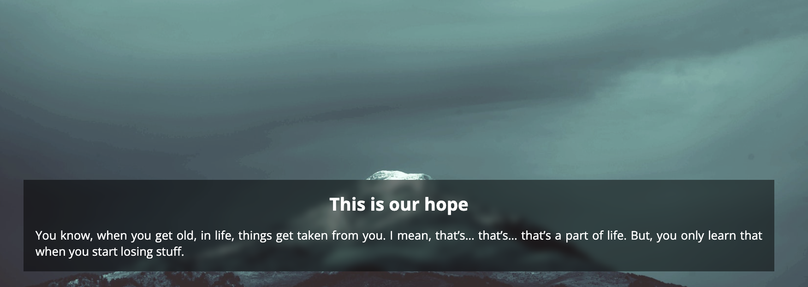
</center>
<br/>

## Menú frozenglass

Al fer un menú superior, se li pot donar un efecte de **"vidre congelat"** per veure com els continguts passen per sota seu al fer scroll.

A la carpeta "./02-Web/Dissenys/exemple-12", a l'arxiu "index.html" escollir la opció **"Show Preview"** per veure la pàgina web.

<center>
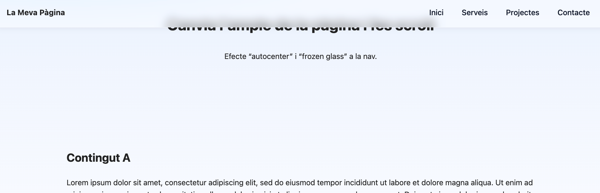
</center>
<br/>

## Peu de pàgina

Els peus de pàgina són la part inferior d’una pàgina on es posa informació addicional o repetida.

A la carpeta "./02-Web/Dissenys/exemple-13", a l'arxiu "index.html" escollir la opció **"Show Preview"** per veure la pàgina web.

<center>
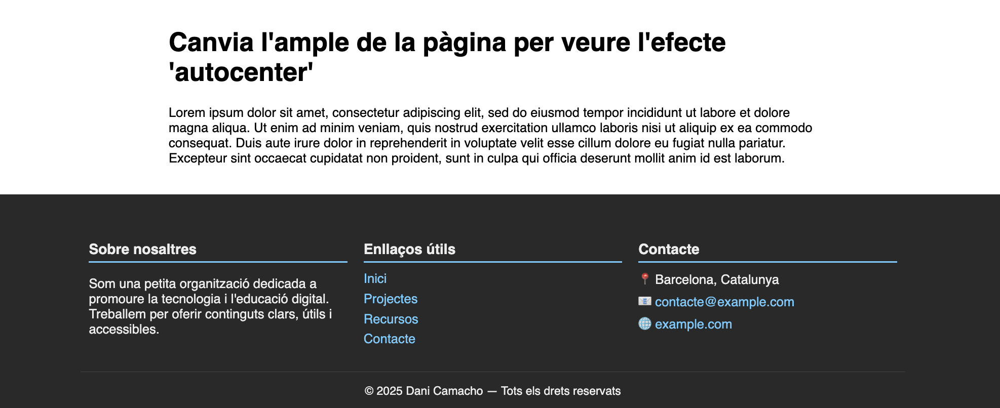
</center>
<br/>

## Taules

Les taules han de contenir dades **(no s'han de fer servir per posicionar)**. I es pot donar estil, per capçaleres, files o columnes.

A la carpeta "./02-Web/Dissenys/exemple-14", a l'arxiu "index.html" escollir la opció **"Show Preview"** per veure la pàgina web.

<center>
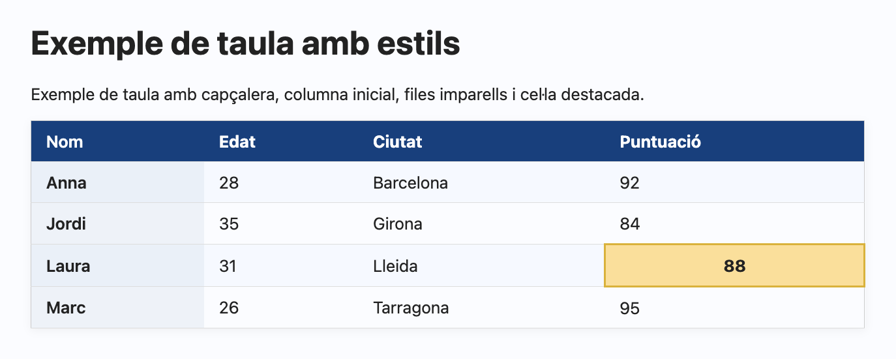
</center>
<br/>


