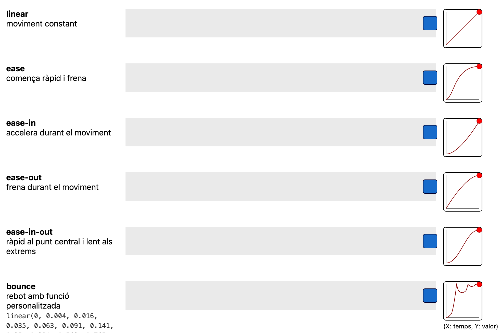

# Animacions

Les animacions en CSS permeten donar moviment i dinamisme als elements d’una pàgina sense fer servir JavaScript. Podem distingir dos tipus principals:

- **Transicions**: s’activen en resposta a un canvi (per exemple, al passar el ratolí per sobre).
- **Animacions**: funcionen de manera autònoma, seguint fotogrames definits per l’autor.

## Transicions

Les transicions permeten canviar suaument un o més valors d’una propietat CSS durant un temps determinat.

Es pot fer transició amb totes les propietats matemàtiques (colors, mides, posicions, opacitat, transform, etc.). 

Quan es vol afectar a diverses propietats alhora, es poden separar amb comes o utilitzar la paraula clau **"all"** per afectar a totes les propietats que canviïn.

| Propietat                    | Descripció               | Exemple                                                |
| ---------------------------- | ------------------------ | ------------------------------------------------------ |
| `transition-property`        | Quina propietat canviarà | `transition-property: background-color;`               |
| `transition-duration`        | Durada del canvi         | `transition-duration: 0.5s;`                           |
| `transition-delay`           | Retard abans de començar | `transition-delay: 0.2s;`                              |
| `transition-timing-function` | Ritme del canvi          | `linear`, `ease`, `ease-in`, `ease-out`, `ease-in-out` |

### Funcions de transició

Les funcions de transició defineixen **com varia la velocitat d’una animació o transició al llarg del temps**.
No canvien la durada total, però sí el ritme del moviment.

<center>

</center>

L'exemple-00 mostra una animació comparant les diferents funcions "timing-function" disponibles.

Exemple-00: Obrir amb "Show preview" la pàgina "02-Web/10-Animacions/exemple-00/index.html"

### Exemple bàsic

Les transicions s'apliquen quan s'ha de canviar d'una classe a una altre, en aquest cas de l'estat normal a l'estat over:

```css
.button {
  background-color: dodgerblue;
  transition: background-color 0.4s ease; 
  /* transition només es defineix a l'estat normal */
}

.button:hover {
  background-color: tomato;
}
```

L'exemple 01 mostra diferents tipus de transicions aplicades al fer *":hover"*.

Exemple-01: Obrir amb "Show preview" la pàgina "02-Web/10-Animacions/exemple-01/index.html"

## Animacions

Les animacions permeten definir una seqüència de canvis mitjançant fotogrames clau (keyframes).

| Propietat                   | Descripció                                                              | Exemple                                |
| --------------------------- | ----------------------------------------------------------------------- | -------------------------------------- |
| `animation-name`            | Nom de la seqüència definida amb `@keyframes`                           | `animation-name: girar;`               |
| `animation-duration`        | Durada d’un cicle complet                                               | `animation-duration: 1.5s;`            |
| `animation-timing-function` | Ritme de l’animació                                                     | `ease`, `linear`, etc.                 |
| `animation-delay`           | Temps abans de començar                                                 | `animation-delay: 0.5s;`               |
| `animation-iteration-count` | Nombre de repeticions (`1`, `infinite`)                                 | `animation-iteration-count: infinite;` |
| `animation-direction`       | Direcció (`normal`, `reverse`, `alternate`)                             | `animation-direction: alternate;`      |
| `animation-fill-mode`       | Manté l’estat inicial o final (`none`, `forwards`, `backwards`, `both`) | `animation-fill-mode: forwards;`       |
| `animation-play-state`      | Permet pausar o reprendre (`running`, `paused`)                         | `animation-play-state: paused;`        |


```css
@keyframes girar {
  0%   { transform: rotate(0deg); }
  50%  { transform: rotate(180deg); background: orange; }
  100% { transform: rotate(360deg); background: dodgerblue; }
}

.logo {
  width: 100px;
  height: 100px;
  background: tomato;
  border-radius: 50%;
  animation: girar 3s linear infinite alternate;
}
```

Es exemples 02 i 03 mostren diferents tipus d'animacions definides amb *keyframes*.

Exemple-02: Obrir amb "Show preview" la pàgina "02-Web/10-Animacions/exemple-02/index.html"

Exemple-03: Obrir amb "Show preview" la pàgina "02-Web/10-Animacions/exemple-03/index.html"

## Diferències entre *transició* i *animació*

| Aspecte                   | **Transició**               | **Animació**                   |
| ------------------------- | --------------------------- | ------------------------------ |
| Necessita un esdeveniment | Sí (`hover`, `focus`, etc.) | No necessàriament              |
| Control sobre fotogrames  | Només inici i final         | Pots definir múltiples passos  |
| Propietats CSS implicades | Limitades                   | Molt més flexibles             |
| Repetició                 | No                          | Sí (`infinite`)                |
| Definició                 | Amb `transition`            | Amb `@keyframes` i `animation` |

## Bones pràctiques

- Usa animacions **curtes i suaus** (entre 0.2s i 1s).
- **Evita animar** propietats que afecten **el layout** (width, height) — prefereix transform o opacity.
- Controla el rendiment: **massa animacions poden alentir la pàgina**.
- Recorda afegir la propietat will-change per millorar el rendiment de transicions freqüents.

```css
.card { will-change: transform; }
```

## Animacions i Scroll

La propietat **"animation-timeline"** és una funcionalitat del CSS que permet sincronitzar una animació amb un **timeline personalitzat**.**

Això vol dir que l’animació no depèn del temps, sinó d’un esdeveniment o estat, com per exemple:

- El **desplaçament** de la pàgina (scroll).
- L’**entrada o sortida d’un element** de la pantalla (view).
- O fins i tot l’activació d’un **":target"** (quan un element és seleccionat via un enllaç amb #id).

L'exemlpe 04 mostra una animació que es activa en funció del desplaçament de **"scroll"** de la pàgina.

Exemple-04: Obrir amb "Show preview" la pàgina "02-Web/10-Animacions/exemple-04/index.html"