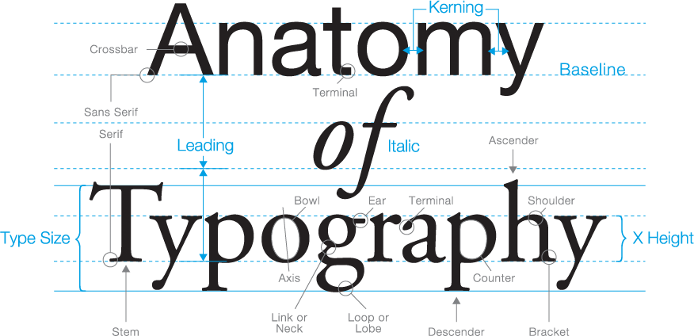
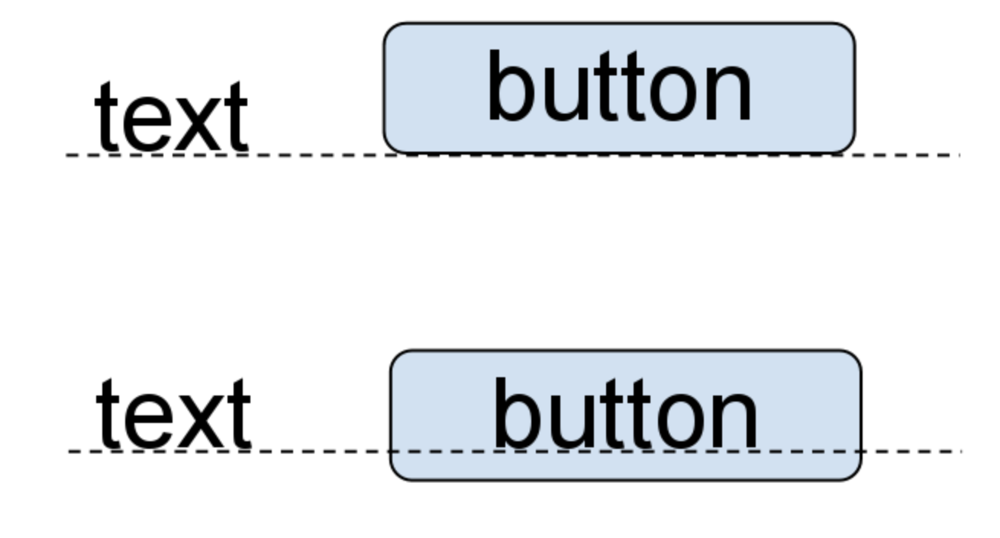

# CSS Avançat

## Colors i unitats

En CSS podem definir colors de diverses maneres. Cada format té avantatges segons el context (compatibilitat, llegibilitat o control de transparència).

| Format           | Exemple                    | Descripció                                                                          |
| :--------------- | :------------------------- | :---------------------------------------------------------------------------------- |
| **Nom de color** | `red`, `blue`, `lightgray` | Útil per proves o colors simples.                                                   |
| **Hexadecimal**  | `#ff0000` → vermell        | Cada parella representa **vermell**, **verd** i **blau** en hexadecimal (`00–ff`).  |
| **RGB**          | `rgb(255, 0, 0)`           | Mateix significat que `#ff0000`, però en decimal (`0–255`).                         |
| **RGBA**         | `rgba(255, 0, 0, 0.5)`     | Afegeix el canal **alfa (transparència)** (`0 = transparent`, `1 = opac`).          |
| **HSL**          | `hsl(0, 100%, 50%)`        | Defineix el color per **to (hue)**, **saturació** i **lluminositat**. Més intuïtiu. |
| **HSLA**         | `hsla(0, 100%, 50%, 0.5)`  | Igual que HSL, però amb **transparència**.                                          |

Un mateix color es pot expressar de diferents maneres:

| Format                             | Exemple                          |
| :--------------- | :--------------- |
| **Nom de color**                             | `color: blue;`                          |
| **Hexadecimal curt (3 dígits)**              | `color: #00f;`                          |
| **Hexadecimal complet (6 dígits)**           | `color: #0000ff;`                       |
| **Hexadecimal amb transparència (8 dígits)** | `color: #0000ff80;`                     |
| **RGB**                                      | `color: rgb(0, 0, 255);`                |
| **RGBA** (alpha = transparència)             | `color: rgba(0, 0, 255, 0.5);`          |
| **RGB amb percentatges**                     | `color: rgb(0%, 0%, 100%);`             |
| **HSL**                                      | `color: hsl(240, 100%, 50%);`           |
| **HSLA** (alpha = transparència)             | `color: hsla(240, 100%, 50%, 0.5);`     |

### Colors per components

| Component        | Significat                 | Rang      | Exemple                                         |
| :--------------- | :------------------------- | :-------- | :---------------------------------------------- |
| **Hue (to)**     | Posició al cercle cromàtic | `0–360°`  | `0=vermell`, `120=verd`, `240=blau`             |
| **Saturació**    | Intensitat del color       | `0%–100%` | `0%` = grisos, `100%` = colors vius             |
| **Lluminositat** | Quantitat de llum          | `0%–100%` | `0%` = negre, `50%` = color pur, `100%` = blanc |
| **Alfa (α)**     | Transparència              | `0–1`     | `0.3` = 30% opacitat                            |
<br/>

Aquestes eines ajuden a escollir els colors:

- [HSL](https://www.hslpicker.com/#c0ff33)
- [W3Schools colos](https://www.w3schools.com/colors/colors_hsl.asp)

## Tipografia

La tipografia és una part essencial del disseny web. 

Permet millorar la llegibilitat i la personalitat visual d’una pàgina.

| Propietat        | Exemple                                    | Descripció                                                              |
| :--------------- | :----------------------------------------- | :---------------------------------------------------------------------- |
| `font-family`    | `font-family: Arial, sans-serif;`          | Defineix la família o tipus de lletra. Pots llistar fonts alternatives. |
| `font-size`      | `font-size: 1.2rem;`                       | Mida del text (millor amb unitats relatives com `rem`).                 |
| `font-weight`    | `font-weight: bold;` o `font-weight: 300;` | Gruix de la lletra.                                                     |
| `font-style`     | `font-style: italic;`                      | Cursiva o normal.                                                       |
| `line-height`    | `line-height: 1.5;`                        | Alçada de línia, per facilitar la lectura.                              |
| `letter-spacing` | `letter-spacing: 0.05em;`                  | Espaiat entre caràcters.                                                |
| `text-transform` | `text-transform: uppercase;`               | Majúscules / minúscules automàtiques.                                   |
| `text-align`     | `text-align: center;`                      | Alineació del text.                                                     |

Aquesta eina permet definir propietats de les fonts CSS:

- [Font tool](https://html-css-js.com/css/generator/font/)

Al parlar de tipografies cal tenir en compte les parts de les fonts:

<center>

</center>

I que els objectes han de quedar alineats per la 'baseline':

<center>

</center>

### Google Fonts

A més de les fonts instal·lades al dispositiu, podem importar tipografies des de serveis web.

Enllaç a : **[Google Fonts](https://fonts.google.com)**

> **Nota:** Les fonts de **"Google Fonts"**, es poden fer servir i redistribuir però no vendre.

Si vols fer servir una font de Google, la opció **"Get Embeded Code"** et dona les capçaleres HTML i el codi CSS que has d'incloure a la pàgina web.

```html
<link rel="preconnect" href="https://fonts.googleapis.com">
<link rel="preconnect" href="https://fonts.gstatic.com" crossorigin>
<link href="https://fonts.googleapis.com/css2?family=Pixelify+Sans:wght@400..700&family=Roboto:ital,wght@0,100..900;1,100..900&display=swap" rel="stylesheet">
```

```css
.pixelify-sans {
  font-family: "Pixelify Sans", sans-serif;
  font-optical-sizing: auto;
  font-weight: <weight>;
  font-style: normal;
}
```

Exemple-00: Obrir amb "Show preview" la pàgina "02-Web/11-CSSAvancat/exemple-00/index.html"

> **Nota**: Fixa't que amb la direcció *URL* de la font, s'indica les mides **"weight"** que estaràn disponibles *"400..700"* (en aquest exemple de la 400 a la 700), a més mides més gran la descàrrega de la font.

### Material icons

**Material icons** és una font d'icones, consulta la llista a la seva pàgina web:

[Web Material Icons](https://fonts.google.com/icons?selected=Material+Symbols+Outlined:home:FILL@0;wght@400;GRAD@0;opsz@24&icon.size=24&icon.color=%231f1f1f)

Per importar-la cal posar aquest `<link>` al `<header>`:

```html
<link rel="stylesheet" href="https://fonts.googleapis.com/css2?family=Material+Symbols+Outlined:opsz,wght,FILL,GRAD@24,400,0,0" />
```

i per fer-la servir, es fa servir un `<span>` amb un o més noms d'icona:

```html
<span class="material-symbols-outlined">smart_toy</span>
<br/>
<span class="material-symbols-outlined">menu balance</span>
```

Exemple-01: Obrir amb "Show preview" la pàgina "02-Web/11-CSSAvancat/exemple-00/index.html"

> **Nota**: Altres tipografies d'icones populars són: [Font Awesome](https://fontawesome.com), [Flaticon](https://www.flaticon.es)

