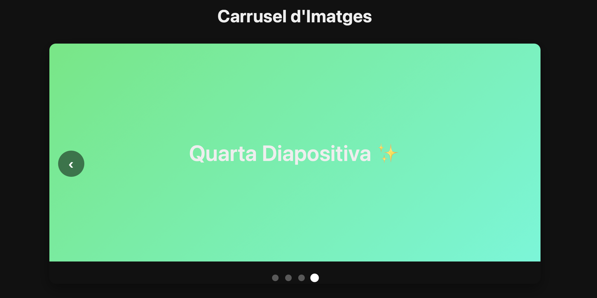
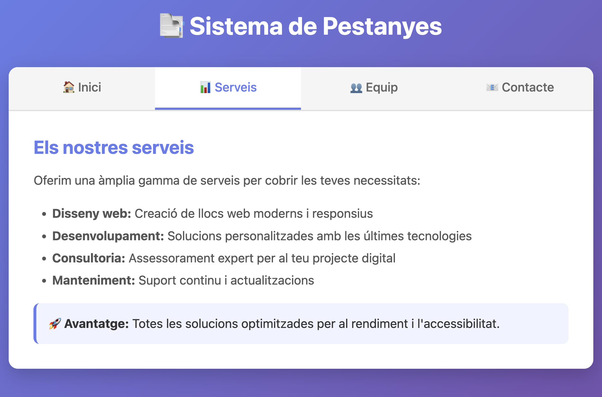
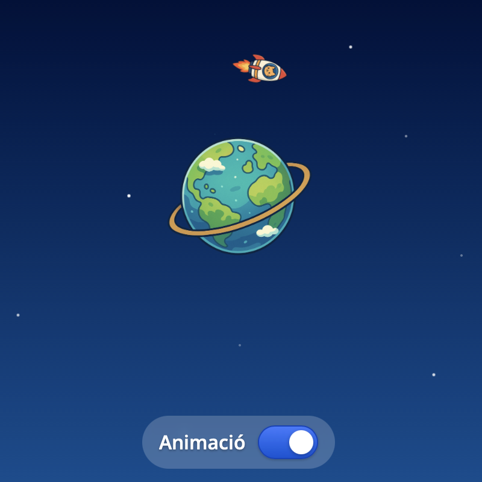

# Interactivitat amb CSS

És possible canviar l’aparença d’un element (per exemple, el color d’una capsa) **sense utilitzar JavaScript, fent servir només HTML i CSS**.

Es fa basant-nos en tres conceptes de CSS i HTML:

1 - Inputs de tipus *"radio"* o *"checkbox"*
  - S’utilitzen per guardar un estat (quin botó està seleccionat).

2 - Etiquetes `<label>` associades a cada input
  - En fer clic sobre un `<label>` amb **for="id"**, automàticament es selecciona el radio amb aquell id.

3 - Selectores CSS avançats (:checked i ~)
  - Permeten detectar quin radio està actiu i aplicar estils a altres elements del document.

<br/>
<center>
<video src="./assets/cssadv-change.mov" width="300" controls></video>
</center>

La diferència entre els `<input>`de tipus *"radio"* i *"checkbox"* és que:

- Els *"radio"* s’exclouen entre ells (només un pot estar seleccionat) 
- Els *"checkbox"* permeten seleccionar múltiples opcions alhora.

Per aquest motiu, els *"radio"* pertanyen a un grup que es defineix amb l’atribut **name**.

<br/>
1 - Definit l'HTML de manera que:
    - Hi ha un `<label>`, amb l'atribut *"for"* fent referència a un radio.
    - Hi ha un `<input type="radio" id="radioX" name="radioGroup">`, amb el mateix *"name"* per agrupar tots els *"input"* que s'han d'excloure entre ells.

```html
  <div class="row">
    <label for="radio0">Color verd</label>
    <input type="radio" name="radioGroup" id="radio0">
  </div>
  <div class="row">
    <label for="radio1">Color vermell</label>
    <input type="radio" name="radioGroup" id="radio1" checked>
  </div>
```

2 - Al CSS:
    - S'usen els selectors `:has(#radioX:checked)` per detectar quin radio està seleccionat.
    - Opcionalment s'amaguen els radio buttons amb `display: none;`

```css
body:has(#radio1:checked) label[for="radio1"] {
  /* Estil aplicat al <label> quan el seu radio està seleccionat (:checked) */
}
body:has(#radio0:checked) .box {
  /* Estil aplicat a .box quan es selecciona el radio0 */
}
```

Exemple-00: Obrir amb "Show preview" la pàgina "02-Web/11-CSSAvancat/exemple-00/index.html"

# Botó alternador *(toggle)*

Es poden crear botons d'alternar *(toggle)* validant només l'estat *"checked"* d'un checkbox.

```html
<label class="toggle" for="wifi">
  <input class="hidden" type="checkbox" id="wifi">
  <span class="indicator" for="wifi"></span>
  <span>Wi-Fi</span>
</label>
```

Aleshores per canviar l'estil segons l'estat *"checked"*, es fa servir el selector `:has(> .hidden:checked)`:

```css
.toggle:has(> .hidden:checked) > .indicator{
  /* Estil quan està activat (ON) */
}
.toggle:has(> .hidden:checked) > .indicator::after{
  /* Estil del cercle/knob quan està activat (ON) */
}
```


<br/>
<center>
<video src="./assets/cssadv-toggles.mov" width="300" controls></video>
</center>

Gràcies els canvis d'estat CSS, sense JavaScript es poden implementar alternadors *(toggle)*

Exemple-01: Obrir amb "Show preview" la pàgina "02-Web/11-CSSAvancat/exemple-01/index.html"

# Capgirar *(flip)* targes

<br/>
<center>
<video src="./assets/cssadv-flipcards.mov" width="300" controls></video>
</center>

Exemple-02: Obrir amb "Show preview" la pàgina "02-Web/11-CSSAvancat/exemple-02/index.html"

# Carousel CSS

<center>

</center>

Exemple d'un carrousel fet únicament amb CSS, sense JavaScript.

Exemple-03: Obrir amb "Show preview" la pàgina "02-Web/11-CSSAvancat/exemple-03/index.html"

## Com funciona el Carrusel CSS (sense JavaScript)

### 1. Radio buttons amagats controlen l'estat

```html
<input type="radio" name="slide" id="slide1" checked>
<input type="radio" name="slide" id="slide2">
```

- Tots comparteixen el mateix `name="slide"`, així només un pot estar `:checked` alhora
- Estan amagats amb `display: none`

### 2. Labels actuen com a botons

```html
<label for="slide2" class="navArrow next">›</label>
<label class="dot" for="slide3"></label>
```

- Quan fas click a un `<label>`, automàticament marca el radio button corresponent (per l'atribut `for`)
- És comportament natiu d'HTML!

### 3. CSS reacciona al `:checked`

```css
#slide1:checked ~ .slides { transform: translateX(0%); }
#slide2:checked ~ .slides { transform: translateX(-100%); }
```

- Quan `#slide2` està `:checked`, el selector `~` (sibling) troba `.slides` i aplica el `transform`
- Això desplaça el contenidor de slides

### Flux complet:
```text
Click al dot/arrow 
  → Label activa el radio button corresponent
    → CSS detecta quin radio té :checked
      → Aplica el transform adequat
        → Les slides es mouen amb transition
```

# Pestanyes CSS

<center>

</center>

Exemple de pestanyes fet únicament amb CSS, sense JavaScript.

Exemple-04: Obrir amb "Show preview" la pàgina "02-Web/11-CSSAvancat/exemple-04/index.html"

## Com funcionen les pestanyes CSS (sense JavaScript)

### 1. Radio buttons amagats controlen l’estat
```html
<input type="radio" name="tab" id="tab1" checked>
<input type="radio" name="tab" id="tab2">
<input type="radio" name="tab" id="tab3">
<input type="radio" name="tab" id="tab4">
```
- Totes les pestanyes comparteixen el mateix name="tab", de manera que **només una pot estar activada (:checked)** alhora.
- Estan amagades visualment amb display: none, però **mantenen el seu comportament intern**.

### 2. Els <label> actuen com a botons de pestanya
```html
<label class="tabButton tabButton1" for="tab1">🏠 Inici</label>
<label class="tabButton tabButton2" for="tab2">📊 Serveis</label>
```

- Cada <label> està associat a un radio button a través de l’atribut for.
- Quan es fa clic en una pestanya, el radio corresponent passa a estar checked.
- Això és funcionalitat nativa d’HTML, no cal cap JavaScript.

### 3. El CSS reacciona al radio seleccionat (:checked)
```css
#tab1:checked ~ .content-1 { display: block; }
#tab2:checked ~ .content-2 { display: block; }
```

- Quan un radio està seleccionat (:checked), el selector ~ (germà general) permet aplicar estils a altres elements del mateix nivell.
- D’aquesta manera, **només es mostra el contingut associat** a la pestanya activa.
- La resta de contingut roman ocult amb display: none.

### 4. L’estil actiu de la pestanya també es controla amb CSS
```css
#tab1:checked ~ .tabButtons .tabButton1 {
  color: #667eea;
  background: white;
  border-bottom-color: #667eea;
}
```
- El mateix mecanisme (:checked ~) serveix per donar **estil visual a la pestanya activa**.
- Canvia color, fons i la línia inferior per indicar quina pestanya està oberta.

### Flux complet
```text
Clic sobre una pestanya (label)
   → Activa el radio button corresponent (:checked)
     → El CSS detecta quin radio està seleccionat
       → Mostra el contingut associat i amaga la resta
         → Aplica l’estil actiu a la pestanya seleccionada
```

## Iniciar i aturar animacions CSS

<center>

</center>
<br/>

Exemple-05: Obrir amb "Show preview" la pàgina "02-Web/11-CSSAvancat/exemple-05/index.html"