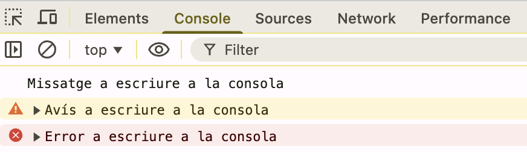
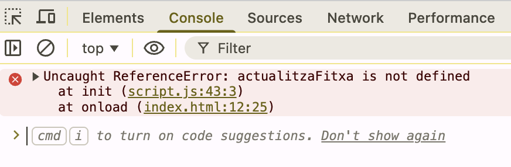

<div style="display: flex; width: 100%;">
    <div style="flex: 1; padding: 0px;">
        <p>© Albert Palacios Jiménez, 2024</p>
    </div>
    <div style="flex: 1; padding: 0px; text-align: right;">
        
    </div>
</div>
<br/>

# DOM (Document Object Model)

El **DOM** (*Document Object Model*) és la manera com el navegador representa una pàgina web per dins.

Quan carregues un fitxer HTML, el navegador no el tracta com un simple text, sinó que el converteix en una estructura d’objectes que JavaScript pot llegir i modificar.

👉 El **DOM** és el **pont** entre HTML i JavaScript.

## El DOM com un arbre

El navegador organitza tots els elements HTML en forma d’arbre:

```html
<body>
  <h1>Títol</h1>
  <p>Un paràgraf</p>
</body>
```

Es representa així:

```text
* document
  └── body
  ├── h1
  └── p
```

Cada etiqueta és un **node** (un objecte) dins del DOM.

## Per què serveix?

El DOM permet que JavaScript pugui:

* trobar elements de la pàgina
* canviar text o estils
* afegir o eliminar elements
* respondre a clics i accions de l’usuari

## JavaScript a les pàgines web

Per incloure codi **JavaScript** a les pàgines web, es fa servir l'element `<script>`

```html
<script src="script.js" defer></script>
```

> **Nota**: Es pot posar codi directament a dins del cos de l'element, però és més recomanable fer-ho en un arxiu amb l'atribut *"src"*.

> **Nota**: *"defer"* fa que el codi JavaScript s'executi quan el DOM ja existeix

## Referència a elements

Per poder modificar els elements del DOM, hem d'obtenir una referència. Hi ha diverses maneres:

**.querySelector** permet obtenir la referència amb el mateix format que es defineixen les classes CSS

```html
  <div id="hola">...</div>
  <div class="segon">2n</div>
```

```javascript
  var refHola = document.querySelector("#hola")
  var refSegon = document.querySelector(".segon")
```

**.getElementById** permet obtenir la referència a partir de l'identificador de l'element

```html
  <div id="nom">Toni</div>
  <div id="cognom">Amorós</div>
```

```javascript
  var refNom = document.getElementById("nom")
  var refCog = document.getElementById("cognom")
```

## Contingut de text dels elements

Hi ha diverses maneres de canviar el contingut dels elements, per canviar el text:

**textContent**: Permet veure i/o modificar el text dins d'un element

```html
  <div id="nom">Toni</div>
```

```javascript
  var refNom = document.getElementById("nom")
  var textNom = refNom.textContent
  // Ara "textNom" conté el valor "Toni"
```

## Estils 'style' dels elements

Es pot canviar l'estil dels elements des de JavaScript amb una referència a l'element i la propietat *".style"*


> **Nota**: Això és com modificar l'element *"style"* de l'element, és per aquest motiu que no es recomana fer servir mai *"style"*, perquè així quan hi ha modificacions sabem que venen de JavaScript.

```html
<div id="txtCol" style="color:blue;">Color del text</div>
```

```javascript
function textColor(value) {
    var ref =  document.querySelector("#txtCol")
    ref.style.color = value;
}
```

Quan un estil té un nom compost, per exemple **"background-color"** es passa a notació *"CamelCase".

```javascript
function backColor(value) {
    var ref =  document.querySelector("#bckCol")
    ref.style.backgroundColor = value;
}
```

## Estils 'class' dels elements

També es poden modificar els estils que hi ha definits en un element, això és útil per canviar-los l'estil o afegir/treure classes

```javascript
// Si un element té la classe "menu"
ref.classList.contains("menu")

// Afegir una classe al 'class' d'un element anomenada "fonsGroc"
ref.classList.add("fonsGroc")

// Treure una classe del 'class' d'un element anomenada "lletresGrans"
ref.classList.remove("lletresGrans")

// Si l'element té la classe "animacio" la treu
// Si l'element no té la classe "animacio" l'afegeix
ref.classList.toggle("animacio")
```

## Modificar variables del CSS

Per modificar el valor d'una variable CSS

```css
:root {
  --color-principal: LightSalmon;
}
```

Com que no es pot accedir al css ":root" modifiquem *"document.documentElement"*

```javascript
document.documentElement.style.setProperty('--color-principal', 'cyan')
```

## Manipular l'estructura del DOM

El DOM és la manera que té el navegador de representar els elements de la pàgina web, organitzats en forma d'arbre. 

- Cada node de l'arbre pot tenir fills, que poden ser altres nodes (elements) o nodes de text.
- No tots els elements HTML poden tenir fills (per exemple , <input>).

Es poden crear nous nodes (elements) amb JavaScript:

```javascript
    var newDiv = document.createElement("div")
    newDiv.setAttribute("id", "nouDiv" + divCounter)
    newDiv.setAttribute("class", "fonsMagenta")
    newDiv.textContent = "Magenta! " + divCounter
```

Els nodes creats amb JavaScript es poden afegir a la pàgina web, com a fills de d'un node 

```javascript
    const ref = document.getElementById("emptyBox")
    ref.appendChild(newDiv)
```

Les funcions per manipular els fills d'un node són:

```javascript
// Afegeix al final
parent.appendChild(node)

// Afegeix al principi
parent.prepend(node)

// Afegeix (accepta text també)
parent.append(node)           

// Inserir a una posició concreta
parent.insertBefore(newNode, referenceNode)

// Elimina un fill concret
parent.removeChild(child)

// Elimina l'últim fill
const last = ref.lastElementChild
if (last) last.remove()

// Elimina directament el node
node.remove()

```

Exemple d'afegir davant dels altres nodes com a primer fill:
```javascript
const parent = document.getElementById("emptyBox")
const firstChild = parent.firstChild
parent.insertBefore(newDiv, firstChild)
```

Exemple de com canviar un node per un altre:
```javascript
const parent = document.getElementById("emptyBox")
const old = parent.firstElementChild
parent.replaceChild(newDiv, old)
```

## Esdeveniments

Hi ha dues maneres d'afegir esdevenimens:

- **Definir crids des de l'HTML de la pàgina web**:

```html
<!-- Executa 'init()' quan s'ha carregat la pàgina -->
<body onload="init()">
```

- **Definir esdeveniments des de JavaScript**:

```javascript
// Executa 'init()' quan s'ha carregat la pàgina
function init () {
  console.log("Pàgina completament carregada")
}
window.addEventListener("load", init)
```

Quan es crea un nou element des de JavaScript, es poden afegir esdeveniments:

```javascript
const btn = document.getElementById("btn")
btn.addEventListener("click", function() {
    alert("Has fet clic!")
})
```

També es pot cridar una funció al definir l'event

```javascript
const refReset = document.getElementById("refReset");
refReset.addEventListener("click", reset);
```

## Consola i execució al Navegador

Emb les eines de desenvolupament dels navegadors, s'inclou la consola on podem veure els missatges de:

```javascript
console.log("Missatge a escriure a la consola")
console.warn("Avís a escriure a la consola")
console.error("Error a escriure a la consola")
```

<center>

</center>

També mostra els errors de compilació o d'execució:

<center>

</center>